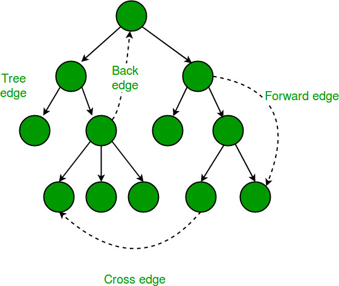

import Tabs from '@theme/Tabs';
import TabItem from '@theme/TabItem';

|  |
| :--------------------------------------------------: |
|               _Types of Edges_[^edges]               |

[^edges]: Image is from <https://www.geeksforgeeks.org/tarjan-algorithm-find-strongly-connected-components/>

|                Item                |           DFS            |           BFS            |
| :--------------------------------: | :----------------------: | :----------------------: |
|           Data Structure           |          Stack           |          Queue           |
|            Vertex Order            |       one sequence       |      two sequences       |
|    Edge Type (Undirected Graph)    |   tree edge, back edge   |  tree edge, cross edge   |
| Time Complexity (Adjacency Matrix) |          O(V^^2)         |         O(V^^2)          |
|  Time Complexity (Adjacency List)  |          O(V + E)        |         O(V + E)         |
|    Worst-case Space Complexity     |          O(V)            |         O(V)             |

Example


Adjacency Matrix


Adjacency List

- 0: 1 -> 2
- 1: 0 -> 2 -> 3
- 2: 0 -> 1 -> 4
- 3: 1 -> 4
- 4: 2 -> 3 -> 5
- 5: 4 -> 6
- 6: 5

## DFS

<Tabs
  defaultValue="py"
  values={[
    { label: 'Python', value: 'py'}
  ]
}>
<TabItem value="py">

```py
def dfs(matrix):
    # taking adjacency matrix
    stack = [0]
    visited = set()
    visited.add(0)
    while stack:
        cur = stack.pop()
        # do something
        print(cur)
        for i, adj in enumerate(matrix[cur]):
            if adj and i not in visited:
                visited.add(i)
                stack.append(i)
```

</TabItem>
</Tabs>

## DFS

<Tabs
  defaultValue="py"
  values={[
    { label: 'Python', value: 'py'}
  ]
}>
<TabItem value="py">

```py
from collections import deque

def bfs(lists):
    # taking adjacency list
    q = deque([0])
    visited = [False] * len(lists)
    visited[0] = True
    while q:
        cur = q.popleft()
        # do something
        print(cur)
        for i in lists[cur]:
            if not visited[i]:
                visited[i] = True
                q.append(i)
```

</TabItem>
</Tabs>

## Level Order Traversal

<Tabs
  defaultValue="py"
  values={[
    { label: 'Python', value: 'py'}
  ]
}>
<TabItem value="py">

```py
from collections import deque

def lot(lists) -> int:
    # taking adjacency list
    q = deque([0])
    visited = [False] * len(lists)
    visited[0] = True
    lv = 0
    while q:
        lv += 1
        print(f'level {lv}')
        for _ in range(len(q)):
            cur = q.popleft()
            # do something
            print(cur)
            for i in lists[cur]:
                if not visited[i]:
                    visited[i] = True
                    q.append(i)
    return lv
```

</TabItem>
</Tabs>