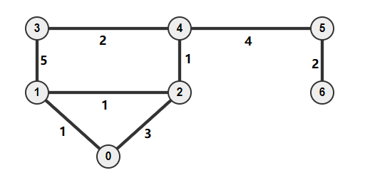
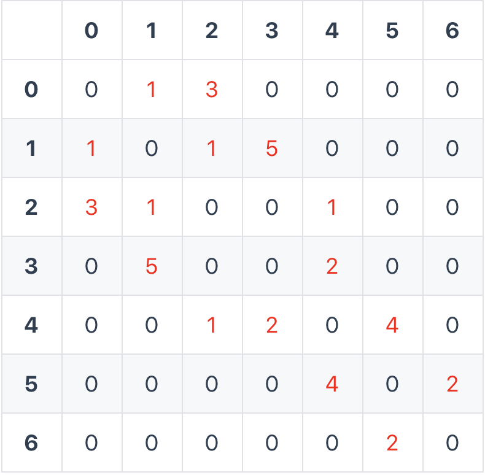

Example



Adjacency Matrix




## Prim's Algorithm

Works fine even with negative weights

Time Complexity: O((|V|+|E|)\log |V|)=O(|E|\log |V|)

<Tabs
  defaultValue="py"
  values={[
    { label: 'Python', value: 'py'},
    { label: 'Java', value: 'java'}
  ]
}>
<TabItem value="py">

```py
from heapq import heappop, heappush
from typing import List

def prim(matrix) -> List[List[int]]:
    # optimized by heap
    n = len(matrix)
    ans = [[0] * n for _ in range(n)]

    h = [(0, 0, 0)]  # weight, node, pre
    visited = set()
    while h:
        weight, cur, pre = heappop(h)
        if cur in visited:
            continue
        visited.add(cur)
        ans[cur][pre] = weight
        ans[pre][cur] = weight
        for i, w in enumerate(matrix[cur]):
            if w > 0 and i not in visited:
                heappush(h, (w, i, cur))
    return ans
```
</TabItem>
<TabItem value="java">
</TabItem>

</Tabs>


[comment]: # "# todo: 加改进版heap"

## Kruskal's Algorithm

Based on [union-find algorithm](./disjoint-sets.md)

Time Complexity: O(|E| \log |E|)

<Tabs
  defaultValue="py"
  values={[
    { label: 'Python', value: 'py'},
    { label: 'Java', value: 'java'}
  ]
}>
<TabItem value="py">

```py
from typing import List

class UnionFind(object):
    def __init__(self):
        self.parent = {}
        self.rank = {}

    def make_set(self, x):
        self.parent[x] = x
        self.rank[x] = 0

    def find(self, x):
        if self.parent[x] != x:
            self.parent[x] = self.find(self.parent[x])
        return self.parent[x]

    def union(self, x, y):
        x_root = self.find(x)
        y_root = self.find(y)
        if x_root == y_root:
            return

        if self.rank[x_root] == self.rank[y_root]:
            self.parent[y_root] = x_root
            self.rank[x_root] += 1
        elif self.rank[x_root] > self.rank[y_root]:
            self.parent[y_root] = x_root
        else:
            self.parent[x_root] = y_root


def kruskal(matrix) -> List[List[int]]:
    n = len(matrix)
    ans = [[0] * n for _ in range(n)]

    edges = []
    for i in range(n):
        for j in range(i):
            if matrix[i][j] > 0:
                edges.append((matrix[i][j], i, j))
    edges.sort()
    cnt = 0
    uf = UnionFind()
    for i in range(n):
        uf.make_set(i)
    for w, x, y in edges:
        if uf.find(x) != uf.find(y):
            uf.union(x, y)
            cnt += 1
            ans[x][y] = w
            ans[y][x] = w
            if cnt >= n - 1:
                break
    return ans
```
</TabItem>

<TabItem value="java">
</TabItem>

</Tabs>
