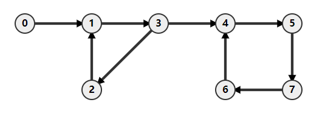

import Tabs from '@theme/Tabs';
import TabItem from '@theme/TabItem';


American computer scientist and mathematician [Robert Tarjan](https://en.wikipedia.org/wiki/Robert_Tarjan) is the discoverer of several graph algorithms, including Tarjan's off-line lowest common ancestors algorithm, and co-inventor of both splay trees and Fibonacci heaps. Here we show Tarjan's strongly connected components algorithm.

This algorithm only runs DFS once. For a graph represented by adjacency list, its worst-case time complexity is O( | V | + | E | )

Example



Adjacency List

- 0: 1
- 1: 3
- 2: 1
- 3: 2 -> 4
- 4: 5
- 5: 7
- 6: 4
- 7: 6

## Tarjan's Algorithm

```py
from typing import List
from collections import OrderedDict


def tarjan(graph: List[List[int]]) -> int:
    n = len(graph)
    dfn = {}
    low = {}
    tree = OrderedDict()
    step = 0
    ans = 0  # number of scc

    def dfs(u):
        nonlocal graph, dfn, low, tree, step, ans
        dfn[u] = step
        low[u] = step
        step += 1
        tree[u] = None
        for v in graph[u]:
            if v not in dfn:
                dfs(v)
                low[u] = min(low[u], low[v])
            elif v in tree:
                low[u] = min(low[u], dfn[v])
        if dfn[u] == low[u]:
            w = None
            while w != u:
                w, _ = tree.popitem()
                print(w, end=' ')
            print()
            ans += 1

    for u in range(n):
        if u not in dfn:
            dfs(u)

    return ans
```
