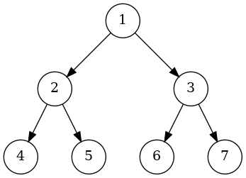

import Tabs from '@theme/Tabs';
import TabItem from '@theme/TabItem';


|            Item             |     DFS      |      BFS      |
| :-------------------------: | :----------: | :-----------: |
|       Data Structure        |    Stack     |     Queue     |
|        Vertex Order         | one sequence | two sequences |
|       Time Complexity       |    O(n)      |     O(n)      |
|      Space Complexity       | O(height)    |   O(width)    |
| Worst-case Space Complexity |    O(n)      |     O(n)      |

Example



Tree Node definition:


<Tabs
  defaultValue="py"
  values={[
    { label: 'Python', value: 'py'}
  ]
}>

<TabItem value="py">

```py
class TreeNode:
    def __init__(self, val=0, left=None, right=None):
        self.val = val
        self.left = left
        self.right = right
```

</TabItem>
</Tabs>

## DFS

<Tabs
  defaultValue="py"
  values={[
    { label: 'Python', value: 'py'}
  ]
}>

<TabItem value="py">

```py
def dfs(root: TreeNode):
    stack = [root]
    while stack:
        node = stack.pop()
        print(node.val)
        if node.left:
            stack.append(node.left)
        if node.right:
            stack.append(node.right)
```

</TabItem>
</Tabs>

## BFS

<Tabs
  defaultValue="py"
  values={[
    { label: 'Python', value: 'py'}
  ]
}>
<TabItem value="py">

```py
from collections import deque

def bfs(root: TreeNode):
    q = deque([root])
    while q:
        node = q.popleft()
        print(node.val)
        if node.left:
            q.append(node.left)
        if node.right:
            q.append(node.right)
```

</TabItem>
</Tabs>


## Level Order Traversal

<Tabs
  defaultValue="py"
  values={[
    { label: 'Python', value: 'py'}
  ]
}>
<TabItem value="py">

```py
from collections import deque

def lot(root: TreeNode) -> int:
    q = deque([root])
    lv = 0
    while q:
        lv += 1
        print(f'level {lv}')
        for _ in range(len(q)):
            node = q.popleft()
            print(node.val)
            if node.left:
                q.append(node.left)
            if node.right:
                q.append(node.right)
    return lv
```

</TabItem>
</Tabs>

## Preorder Traversal

<Tabs
  defaultValue="py"
  values={[
    { label: 'Python', value: 'py'}
  ]
}>
<TabItem value="py">

```py
def preorder(root: TreeNode):
    if not root:
        return
    print(root.val)
    preorder(root.left)
    preorder(root.right)
```

```py
from typing import List

def preorder_without_recursion(root: TreeNode) -> List[int]:
    ans = []
    stack = [root]
    while stack:
        node = stack.pop()
        if node is None:
            continue
        ans.append(node.val)
        stack.append(node.right)
        stack.append(node.left)
    return ans
```

</TabItem>
</Tabs>


## Inorder Traversal

<Tabs
  defaultValue="py"
  values={[
    { label: 'Python', value: 'py'}
  ]
}>
<TabItem value="py">

```py
def inorder(root: TreeNode):
    if not root:
        return
    inorder(root.left)
    print(root.val)
    inorder(root.right)
```

```py
from typing import List

def inorder_without_recursion(root: TreeNode) -> List[int]:
    ans = []
    stack = []
    now = root

    while stack or now:
        if now:
            stack.append(now)
            now = now.left
            continue
        else:
            node = stack.pop()
            ans.append(node.val)
            now = node.right
    return ans
```

</TabItem>
</Tabs>

## Postorder Traversal

<Tabs
  defaultValue="py"
  values={[
    { label: 'Python', value: 'py'}
  ]
}>
<TabItem value="py">

```py
def postorder(root: TreeNode):
    if not root:
        return
    postorder(root.left)
    postorder(root.right)
    print(root.val)
```

```py
from typing import List

def postorder_without_recursion(root: TreeNode) -> List[int]:
    if not root:
        return []

    ans = []
    stack = []
    now = root

    while True:
        while now:
            if now.right:
                stack.append(now.right)
            stack.append(now)
            now = now.left
        now = stack.pop()
        if stack and stack[-1] is now.right:
            stack.pop()
            stack.append(now)
            now = now.right
        else:
            ans.append(now.val)
            now = None
        if not stack:
            break
    return ans
```

</TabItem>
</Tabs>