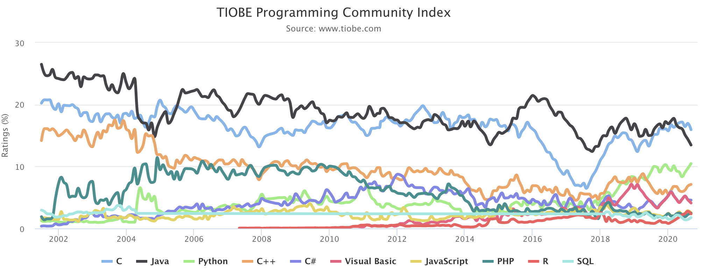

To be a good programmer, you have to be a lifelong learner. The TIOBE Programming Community index is an indicator of the popularity of programming languages, which can be used to check whether your programming skills are still up to date or to make a strategic decision about what programming language should be adopted when starting to build a new software system. The definition of the TIOBE index can be found [here](https://www.tiobe.com/tiobe-index/programming-languages-definition/).

The chart below shows the changes in the popularity of the top 10 programming languages in the last 20 years.

Though we have many languages with different feature, the core concepts and implementations of programming languages never changed a lot. The following sections show my notes of implementing these same ideas in different programming languages.